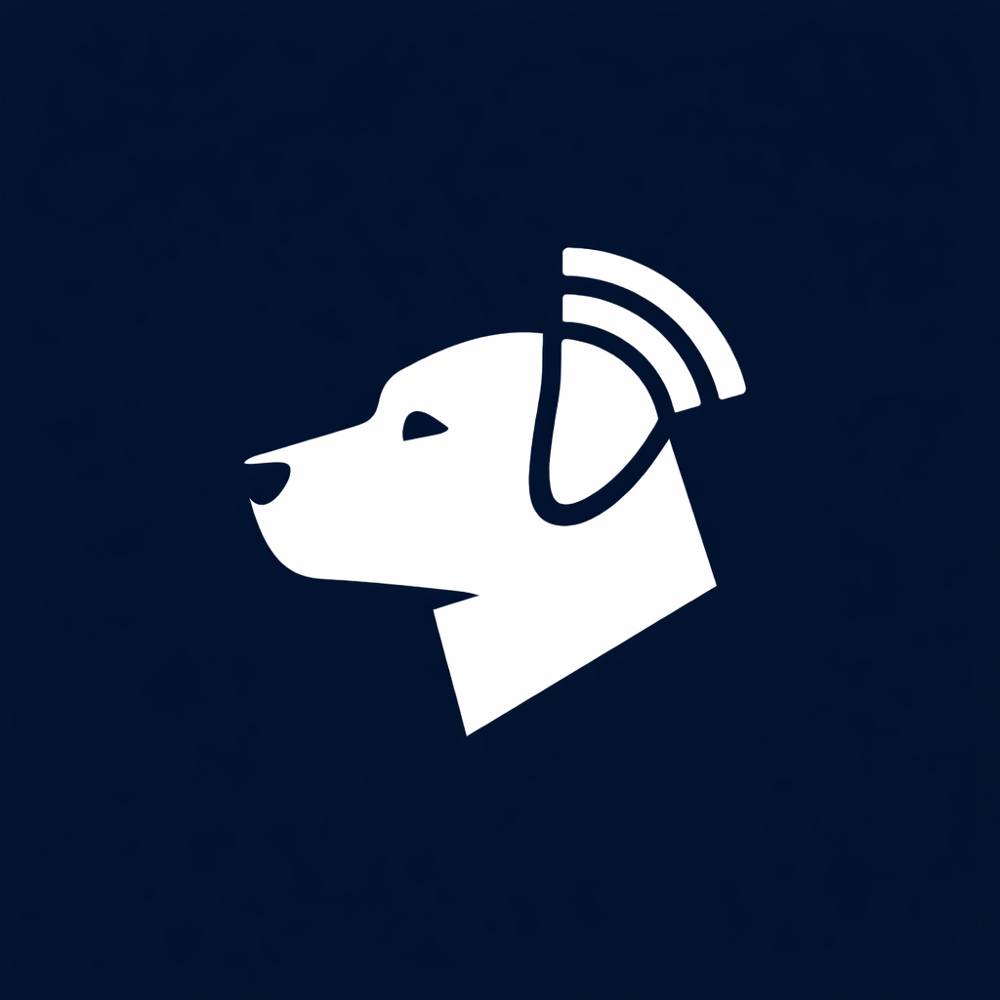

<p align="center">
  
</p>

# Alfie

A BLE-enabled accessory that provides SMS-style messaging over DECT NR+. This project is in its early stages of development.

You can follow along with the development of this project in the [blog series](https://evanstoddard.com/posts/dect_nr_plus_alfie_part_1/).

## Overview

Alfie uses the DECT NR+ radio standard to send and receive short messages between devices. A BLE interface allows mobile devices to connect and interact with the device as an accessory.

## Architecture

The firmware is built on the nRF Connect SDK (NCS) v3.1.1 and Zephyr RTOS, targeting Nordic Semiconductor hardware with DECT NR+ modem support.

The application is organized into three layers:

- **Alfie Protocol** - Application layer defining message types, routing, and future functionality like read receipts and typing indicators.
- **Transport Layer** - Manages message framing, fragmentation, reassembly, and reliable delivery on top of the link layer.
- **Link Layer** - Handles low-level DECT NR+ modem interaction including transmission, reception, and carrier configuration.

## Building

This project uses the [nRF Connect SDK](https://docs.nordicsemi.com/bundle/ncs-latest/page/nrf/index.html) build system. Helper scripts are provided to automate setup and building.

```sh
./scripts/init_project.sh  # Install dependencies and initialize the project
./scripts/build.sh          # Build the firmware
./scripts/flash.sh          # Flash the firmware to the device
```

## License

MIT License. See [LICENSE](LICENSE) for details.
